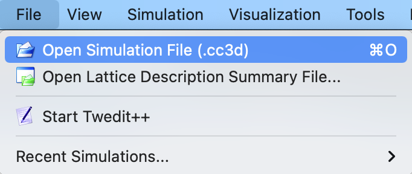
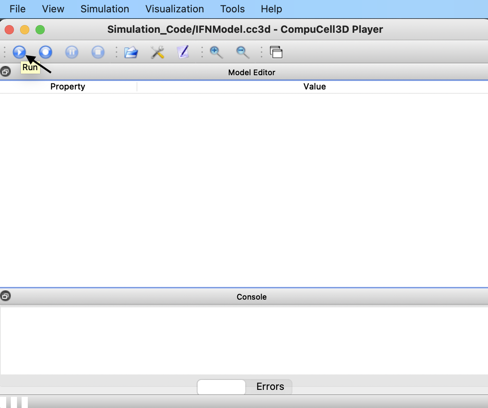
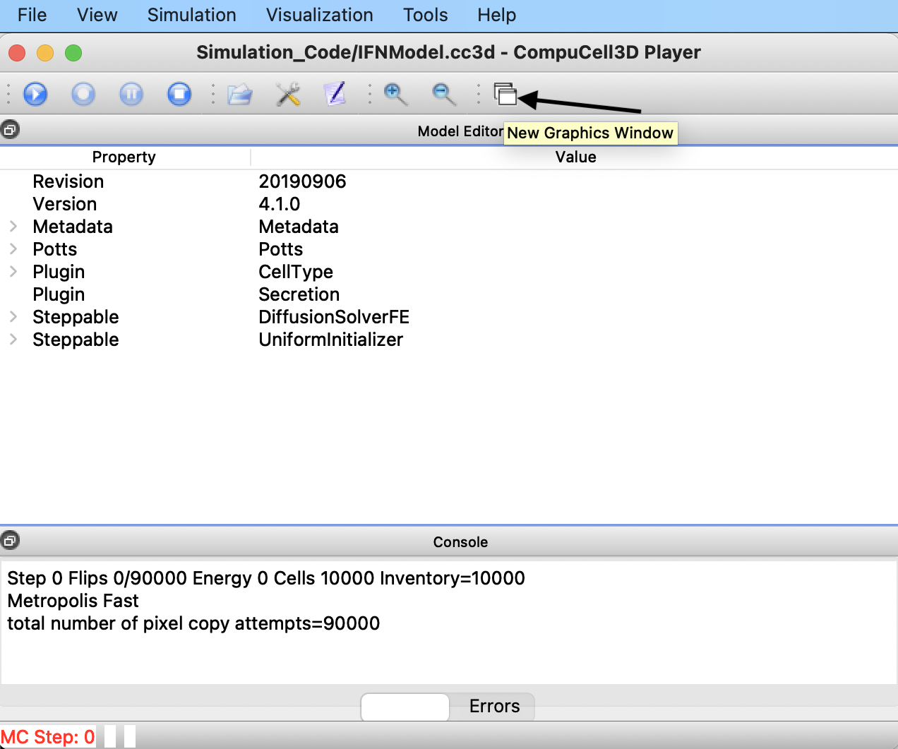
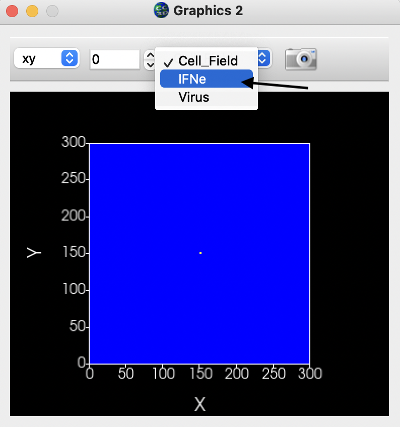

# Multicellular Spatial Model of IFN Response to Viral Infection

This respository contains the code to implement the model and results presented in 
**Multicellular Spatial Model of RNA Virus Replication and Interferon Responses Reveals Factors Controlling Plaque Growth Dynamics**: 
https://www.biorxiv.org/content/10.1101/2021.03.16.435618v1

The directory Simulation_Code contains the code to simulate the model using CompuCell3D (CC3D). Users need a local 
version of CC3D to execute the code and clone this repository to their local machines.

Inside the directory, users can find the main simulation file: **IFNModel.cc3d**. 
To execute the base simulation lunch CompuCell3D and load the simulation file: File > Open Simulation File (.cc3d).

Locate the main simulation file **IFNModel.cc3d** and execute the simulation by hitting the **Run** button.

Since configuration files are not shared in this repository, display configurations might be slightly different for each user. 
By default, CC3D displays a single graphic window showing the *Cell_Field*, which corresponds to the cell lattice colored 
by their different types. To display the extracellular species (Virus and IFN), click on the **New Graphics Window** button.

In the new graphics window, choose the specific extracellular species of interest from the pulldown menu.

